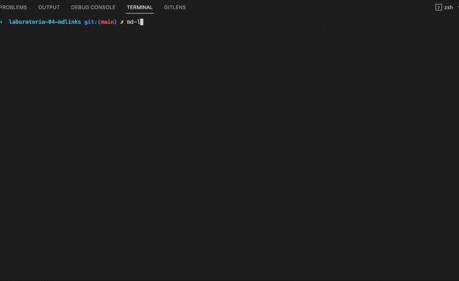

# MDLINKS

NPM module published in npmjs that validates an .md file or path and returns the number of links that it has and the status of each one.

You can find MDLinks here: <a href="https://www.npmjs.com/package/@frankurk/md-links" target="_blank">@frankurk/md-links</a>

## Installation

`npm i @frankurk/md-links`

## Usage

Run md-links in the terminal, along with the path or file you want to evaluate.


## Return value:

```
href: URL found
text: Text inside the link
file: File path
```


## --validate (as argument)
If you add the `--validate` argument, it will return the following:
```
href: URL found
text: Text inside the link
file: File path
status: HTTP response code.
statusText: Not found message in case of failure or ok in case of success.
```


## --stats (as argument)
If you add the `--stats` argument the output will be a text with basic statistics about the links:
```
total: number of links in the file
unique: number of unique links (not repeated)
```




